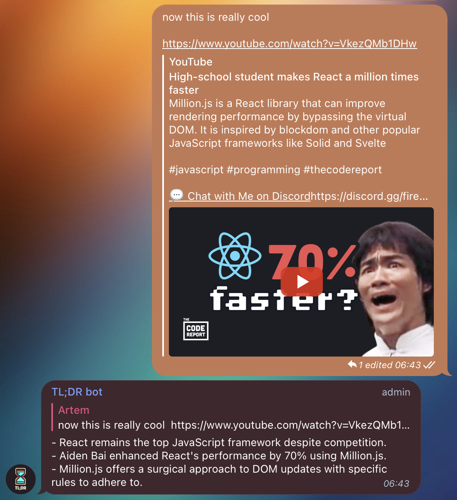

_(generated by Bing with DALL-E)_

# TL;DR bot 📜

TL;DR bot is a handy and fun Telegram bot that will reply to any message containing a video link with a short summary of the video. It uses LangChain and OpenAI API to extract the contents of the video (speach -> text) and then summarizes and formats it in a neat and concise way.

## Features

- Automatically detects video links in any message 🔎
- Supports only YouTube for now
- Ignores songs

## How to use 🤔

To use the bot, you need to:

- Create a Telegram account if you don't have one already 📲
- Search for @tldr_ai_bot in Telegram or click [here](https://t.me/tldr_ai_bot) to open it 🔍
- Start a chat with the bot or add it to a group chat 💬
- Send any message containing a video link and wait for the bot to reply 🕒

## Example

Here is an example of how the bot works:

  

### Based on the great https://github.com/Hamagistral/GPTube
